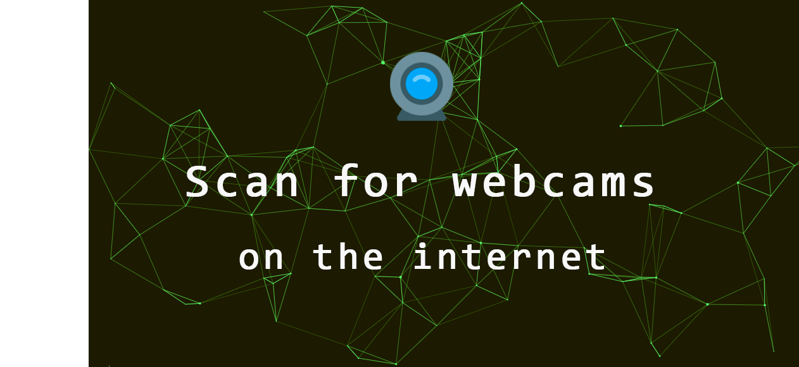

# scan-for-webcams :camera:

[中文文档](/zh/README.md)

## Note
I switched to a new method of [installing](#Installation) this program 
for a better developer experience and better modifiability.

As result, the PYPI package `scan-for-webcams` is not maintained anymore, and 
should be considered deprecated.

## Table of contents

- [Usage](#Usage)
- [Installation](#Installation)
- [Demo](#Demo)

## Usage

* `python sfw search MJPG` : for public [MJPG streamers](https://github.com/jacksonliam/mjpg-streamer)

* `python sfw search webcamXP` : for public [webcamXP streamers](http://www.webcamxp.com/)

* `python sfw search yawCam`: for public [yawCam steamers](https://www.yawcam.com/)

* ` python sfw search --help`: for more options and help

The program will output a list of links with the format of `ip_address:port`, and descriptions of the image beneath it.

If your terminal supports links, click the link and open it in your browser, otherwise, copy the link and open it in your browser.

## Installation
1. Clone this repository: `git clone https://github.com/JettChenT/scan-for-webcams`

2. install requirements.txt: `pip install -r requirements.txt`

3. set up shodan:
   go to [shodan.io](https://shodan.io), register/log in and grab your API key

4. set up clarifai:
   go to [clarifai.com](https://clarifai.com), register/log in, create an application and grab your API key

5. setup geoip:
   go to [geo.ipify.org](https://geo.ipify.org), register/log in and grab your API key
   
6. Add API keys:
   1. run `python sfw setup`
   2. enter your shodan, clarifai and geoip API keys

And then you can [run](#Usage) the program!

## Demo

